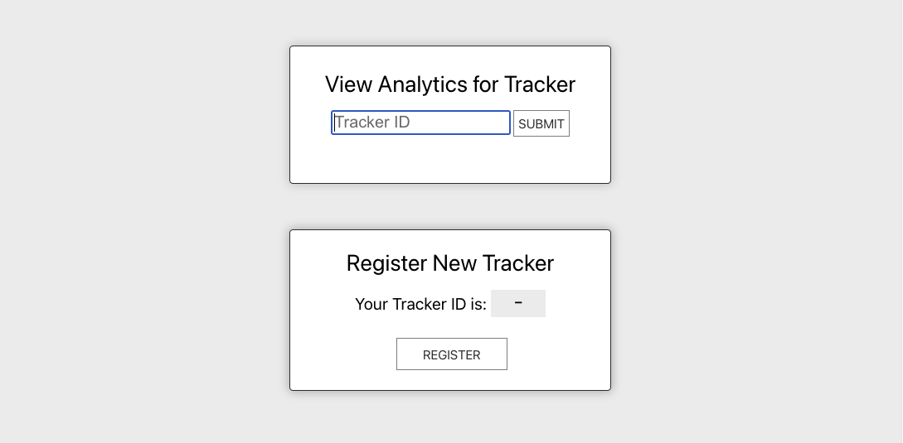
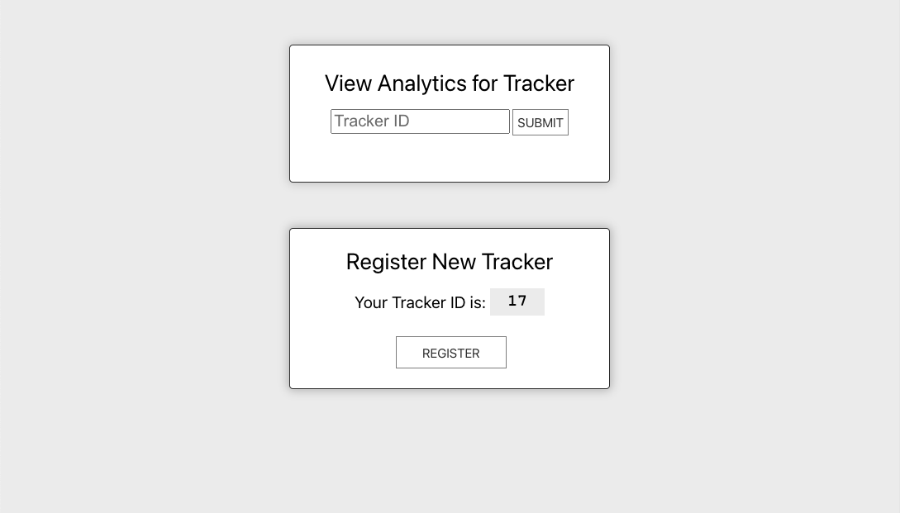
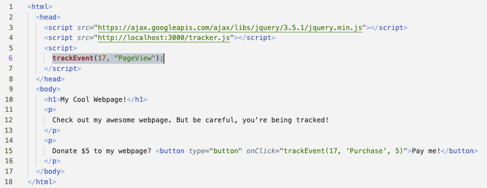
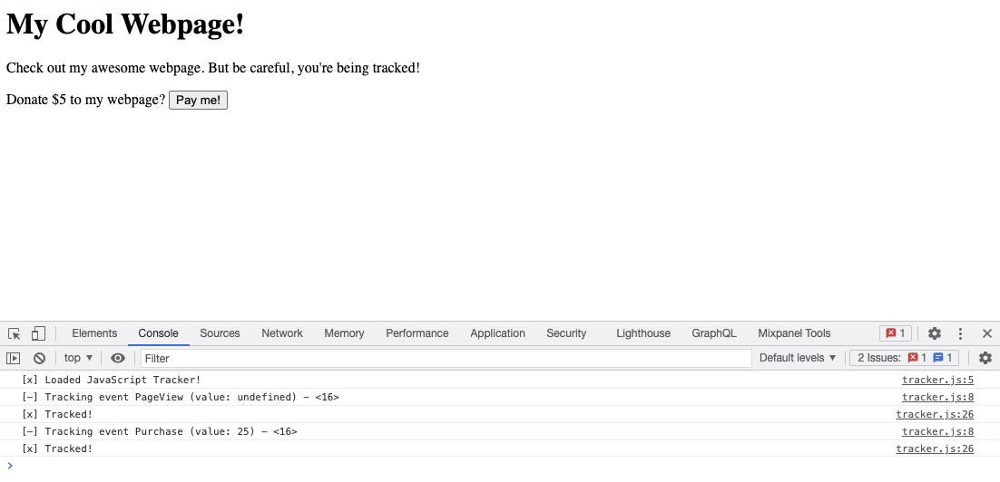
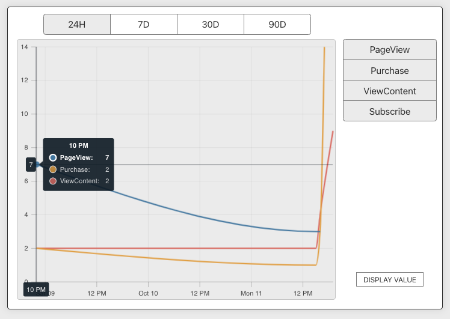

# Basic User Analytics Dashboard

## Overview

This sample project provides a dashboard to view usage statistics of client webpages which have installed a custom JavaScript tracker, much like the Facebook Pixel.

It is built using Typescript, TypeORM, GraphQL, and React.

## Project Structure

```
src/
|_ app/            (1)
  |_ public/         
|_ api/            (2)
  |_resolvers/       
|_ models/         (3)
```

The project is split into two servers:

1. The frontend server: This serves the dashboard which allows users to see usage statistics (traffic, events) captured from any number of clients' websites. This server also hosts the vanilla JavaScript tracker code, which would be embedded in client websites using a JavaScript `<script>` tag.

2. The backend API: This API processes all incoming tracking events from JavaScript trackers all across the web. This API has a direct connection to a data store which stores all usage statistics and analytics then surfaced to the dashboard via its GraphQL endpoint.

Both the frontend server and backend API share models (3) between them. 

*Why split the logic into two servers instead of hosting the processing endpoint and dashboard-serving endpoint from the same server?*

This design decision was intentionally made so that in deployment the FE app and BE API can be scaled as needed independently. Where it may make sense to scale the data processing API vertically to give its instances more resources, it may make more sense to scale the FE server horizontally, because though serving pages isn't resource-intensive the instances could be overwhelmed by a surge of traffic.

## How to Run

##### Pre-Requisites

You'll need a PostgreSQL database running locally on your machine with a database `pageviewtracking`. 

This database name is configurable and can be changed in the `.env` file (which you will create below).

##### Install Dependencies

Install the necessary dependencies by running. 

```
npm install
```

*Note:* This project was developed using `node v.15.1.0` and `npm 7.0.8`, though earlier and later versions may work.

##### Configure the Project Environment

Copy the included local environment into an environment file.

```
cp .local-env .env
```

Edit the `.env` file to reflect your local environment. 

*Note:* This project requires a running PostgreSQL database that it can connect to via  URL, which should include credentials.

##### Start the Servers

Start the API server.

```
npm run start:api
```

Start the frontend server.

```
npm run start:app
```

Navigate to `localhost:3000` and, if you've started this project correctly, you should see the dashboard homepage!

## Screenshots

When the server is started correctly,  you'll see the following home page.



In order to track activity, a tracker needs to be registered. The ID of that tracker will be used in the `tracker.js` script.



The ID is then used in every call to `trackEvent()` to send events to the analytics dashboard.



The tracker can be validated to be working correctly through calls to `console.log()`.



All calls are immediately reflected in the analytics dashboard.



## Database Schema

#### Tracker

The `Tracker` model is in theory associated specifically to (1) webpage. With more time, I might have added some level of domain verification to create a `Tracker` object. This could be done most securely by asking for the user to make a simple a DNS modification on the webpage itself. A domain verification pipeline could then pick up the verification task and query the domain to verify it and authorize the `Tracker` model for traffic coming from that specific domain. 

In its simplest form, I could have added a required `domain` field on `Tracker` creation. Any inbound events associated with that `Tracker` could then be checked against the stored domain.

```(javascript)
@Entity()
export class Tracker extends BaseEntity {
  readonly id: string;
}
```

#### TrackerEvent

The `TrackerEvent` model is associated to (1) singular event sent from a client's webpage. An event might be a page view, the loading of a certain piece of content, the purchase of an item, etc. A `TrackerEvent` has an associated `name` (e.g. "PageView" or "Purchase") and an optional `value` (e.g. a $15 purchase).

`TrackerEvent` models have a many-to-one association to `Tracker` models. In other words, one `Tracker` has many events which are associated with it.

Events are then displayed in the analytics dashboard. Users can filter by event type (which is discerned by the `name` parameter) and they can toggle whether to view events by count (i.e. how many events were processed) or by value (i.e. the aggregated sum of values for that type of event).

```
@Entity()
export class TrackerEvent extends BaseEntity implements ITrackerEvent {
  @Field(() => ID)
  @PrimaryGeneratedColumn()
  readonly id: string;

  @ManyToOne((type) => Tracker)
  tracker: Tracker;

  @Field(() => String)
  @Column()
  timestamp: string;

  @Field(() => String)
  @Column()
  name: string;

  @Field(() => Number, { nullable: true })
  @Column({ nullable: true, type: 'real' })
  value?: number;
}
```

## Next Steps

This project was completed in 5-15 hours. There are many ways it could be improved in further iterations to optimize performance, enhance reliability, or make it more scalable and maintainable.

The following list is not comprehensive, but only meant to demonstrate my own thinking on some of the many ways this project could be improved.

#### Productionization

###### Problem: Event processing

One of the largest opportunities for improvement is in the processing of events. As written, the backend GraphQL endpoint processes tracking events one at a time. In a production environment, it would likely quickly become overwhelmed with incoming events. 

###### Solution: Message queues

The most effective solution to this problem might be to add an intermediary message processing layer to the API endpoint. Incoming events would be queued immediately and processed asynchronously. If the API endpoint crashed, the messages would be retained, and this would allow for easy horizontal scaling of processing instances which could read from the same message queue source.

#### Security

###### Problem: Accessing other user's tracking data

A massive issue is that tracking events are only "protected" insofar as someone doesn't have your tracking ID. Another problem is that other users can send events to your tracker if they get your ID and use it as an attack vector to obfuscate your analytics. 

###### Solution: Login/registration flow

The most realistic solution to this problem is implementing a login/registration flow for users. That way, tracking data would be protected behind the associated account which created the tracker, not just the ID.